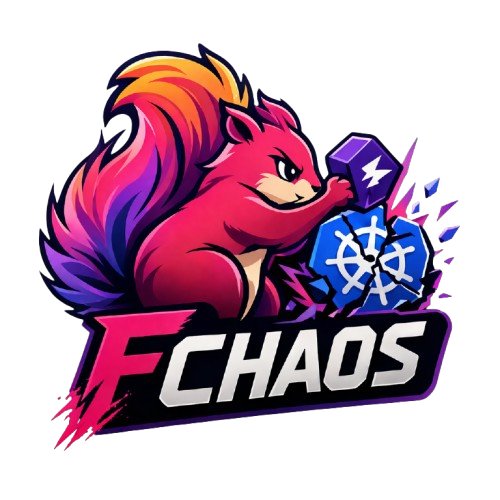

# Flink Chaos Operator



[](https://opensource.org/licenses/Apache-2.0)
[](https://golang.org)
[](https://kubernetes.io)

A Kubernetes-native chaos engineering tool for Apache Flink. Inject controlled failures into Flink workloads and validate recovery behavior — safely, without privileged node agents or DaemonSets.

## Scenarios

| Scenario | Mechanism | Description |
|----------|-----------|-------------|
| `TaskManagerPodKill` | Kubernetes pod delete | Kill one or more TaskManager pods and monitor recovery. |
| `NetworkPartition` | Kubernetes NetworkPolicy | Binary traffic isolation between Flink components. |
| `NetworkChaos` | Ephemeral container + `tc` | Latency, jitter, packet loss, and bandwidth limits. |
| `ResourceExhaustion` | Ephemeral container + `stress-ng` | CPU or memory exhaustion on TaskManager pods. |

## Target Types

- **FlinkDeployment** — Apache Flink Kubernetes Operator workloads
- **VervericaDeployment** — Ververica Platform-managed deployments (Kubernetes-native discovery)
- **PodSelector** — Custom label-based pod selection

## Quick Start

```bash
# Install
helm install fchaos ./charts/flink-chaos-operator -n streaming --create-namespace

# Kill 1 random TaskManager
kubectl fchaos run tm-kill \
  -n streaming \
  --target-type flinkdeployment \
  --target-name orders-app \
  --count 1

# Watch progress
kubectl fchaos status orders-tm-kill-001 -n streaming --watch

# List all runs
kubectl fchaos list -n streaming

# Stop a run
kubectl fchaos stop orders-tm-kill-001 -n streaming
```

## Architecture

```
┌─────────────┐
│  kubectl    │
│   fchaos    │
└──────┬──────┘
       │ creates/patches
       v
┌──────────────────────────┐
│  ChaosRun (CRD)          │
└──────┬───────────────────┘
       v
┌──────────────────────────────────────┐
│  Reconciliation Controller           │
│  Pending → Validating → Injecting    │
│  → Observing → CleaningUp → Done     │
└──────┬───────────────────────────────┘
       │
       ├─────────────┬──────────────┬─────────────┐
       v             v              v             v
  Target         Safety         Scenario      Observer
  Resolvers      Checker        Driver        (K8s + Flink REST)
```

## Prerequisites

- Go 1.25+ (for building from source)
- Kubernetes 1.25+
- kubectl
- Helm 3

## Installation

### Helm (recommended)

```bash
helm install fchaos ./charts/flink-chaos-operator -n streaming --create-namespace
```

Key values:

| Value | Default | Description |
|-------|---------|-------------|
| `watchNamespace` | `""` | Namespace to watch (empty = release namespace). |
| `installCRD` | `true` | Install the CRD automatically. |
| `networkchaos.tcImage` | `ghcr.io/flink-chaos-operator/tc-tools:latest` | Image for `tc` tools (NetworkChaos). |
| `resourceExhaustion.stressImage` | `ghcr.io/flink-chaos-operator/stress-tools:latest` | Image for `stress-ng` (ResourceExhaustion). |
| `defaults.safety.maxConcurrentRunsPerTarget` | `1` | Maximum concurrent runs per target. |
| `defaults.safety.minTaskManagersRemaining` | `1` | Minimum TaskManagers after injection. |
| `defaults.safety.maxNetworkChaosDuration` | `5m` | Duration cap for NetworkChaos. |
| `defaults.safety.maxResourceExhaustionDuration` | `5m` | Duration cap for ResourceExhaustion. |

### Build from Source

```bash
make build          # controller + CLI binaries
make docker-build   # Docker image
make deploy         # deploy CRD + manifests
sudo cp bin/kubectl-fchaos /usr/local/bin/
```

## Documentation

| Topic | Link |
|-------|------|
| **Usage Guidelines** | [docs/guidelines/](docs/guidelines/README.md) |
| Quick Start | [docs/guidelines/quick-start.md](docs/guidelines/quick-start.md) |
| ChaosRun API Reference | [docs/api-reference.md](docs/api-reference.md) |
| Target Types | [docs/target-types.md](docs/target-types.md) |
| Scenario: TaskManagerPodKill | [docs/scenarios/task-manager-pod-kill.md](docs/scenarios/task-manager-pod-kill.md) |
| Scenario: NetworkPartition / NetworkChaos | [docs/scenarios/network-chaos.md](docs/scenarios/network-chaos.md) |
| Scenario: ResourceExhaustion | [docs/scenarios/resource-exhaustion.md](docs/scenarios/resource-exhaustion.md) |
| Safety | [docs/safety.md](docs/safety.md) |
| CLI Reference | [docs/cli-reference.md](docs/cli-reference.md) |
| Metrics | [docs/metrics.md](docs/metrics.md) |
| RBAC and Security | [docs/rbac.md](docs/rbac.md) |
| Development | [docs/development.md](docs/development.md) |
| Troubleshooting | [docs/troubleshooting.md](docs/troubleshooting.md) |
| Roadmap | [docs/roadmap.md](docs/roadmap.md) |

## License

Apache License 2.0. See [LICENSE](LICENSE) for details.
