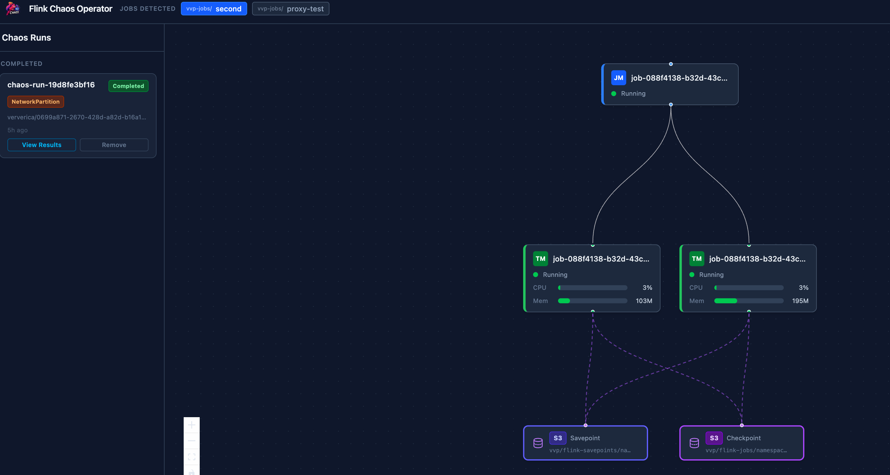
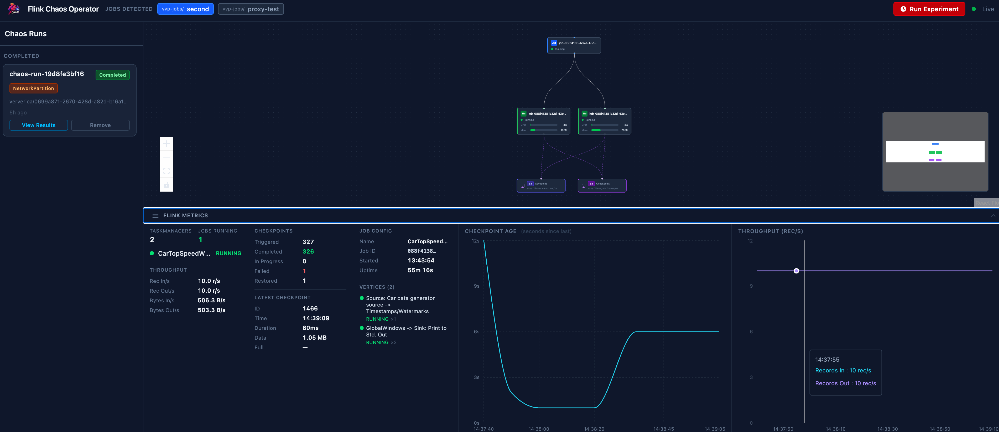

# Flink Chaos Operator — Web UI

The Web UI provides a real-time view of your Flink cluster topology and a point-and-click interface for running chaos experiments.



---

## Installation

The UI is deployed as an optional component of the Helm chart.

```bash
# Deploy operator + UI with Ingress
helm install fchaos ./charts/flink-chaos-operator \
  -n streaming --create-namespace \
  --set ui.enabled=true \
  --set ui.ingress.enabled=true \
  --set ui.ingress.host=flink-chaos.mycompany.com
```

For local access without an Ingress:

```bash
kubectl port-forward -n streaming deployment/fchaos-flink-chaos-operator-ui 8090:8090
# Open http://localhost:8090
```

See [Installation](../README.md#installation) for the full list of Helm values.

---

## Layout

```
┌───────────────────────────────────────────────────────────────┐
│  Header bar: deployment selector · Run Experiment button       │
├──────────────┬────────────────────────────────────────────────┤
│  Chaos Runs  │  Topology diagram (React Flow canvas)          │
│  sidebar     │                                                 │
│              │  JM node(s) — centered at top                  │
│  Active runs │  TM nodes   — grid in middle                   │
│  Completed   │  Storage    — S3/GCS buckets at bottom         │
│  runs        │                                                 │
├──────────────┴────────────────────────────────────────────────┤
│  Flink Metrics panel (collapsible)                             │
│  Job stats · Checkpoint counters · Checkpoint Age chart        │
│  Throughput chart                                              │
└───────────────────────────────────────────────────────────────┘
```

---

## Topology Diagram

The topology panel auto-refreshes every 5 seconds and shows the live state of the Flink cluster in three levels:

- **JobManager** — shown at the top, centered.
- **TaskManagers** — shown in a grid below (up to 4 per row). Each node shows pod name, phase, CPU load bar, and memory bar.
- **Storage** — checkpoint and savepoint buckets shown at the bottom, connected to TaskManagers with dashed lines.

### Chaos overlays

When an experiment is active, the affected nodes change appearance to reflect the scenario:

| Scenario | Visual signal |
|----------|--------------|
| `TaskManagerPodKill` | Red left border, pulsing opacity, skull icon, striped overlay |
| `NetworkPartition` / `NetworkChaos` | Animated dashed red edge between affected nodes |
| `ResourceExhaustion` | Orange left border + glow, flame icon, orange CPU/mem bars |

Hovering over a completed run in the sidebar highlights the pods that were targeted (sky-blue ring on nodes).

---

## Chaos Runs Sidebar

The left sidebar lists all experiments in the namespace, grouped into **Active** and **Completed**.

- **Active runs** show the current phase badge (Pending, Injecting, Observing, CleaningUp) and an **Abort** button.
- **Completed runs** show a phase badge and a **View Results** button that opens the experiment detail modal.

---

## Running an Experiment

Click **Run Experiment** in the header (or right-click a node on the diagram) to open the wizard.

The wizard walks through four steps:

1. **Target** — select the Flink deployment and which pods to target.
2. **Scenario** — choose the chaos type and configure its parameters (duration, count, latency, bandwidth, CPU/memory pressure, etc.).
3. **Safety** — review the safety guardrails that will be applied.
4. **Review** — confirm the experiment before submitting.

---

## Experiment Results Modal

Clicking **View Results** on a completed run opens a centered modal with:

- Phase and verdict badge (Passed / Failed / Inconclusive).
- **Impact Comparison** — average checkpoint age and throughput split across three windows:
  - **Before** — 5 minutes prior to the experiment.
  - **During** — the experiment window.
  - **After** — from experiment end to now.
- Timing (started, ended, total duration, observation threshold).
- Injected pods and network policies created.
- Final operator message.

> The before/during/after comparison requires the metrics panel to have been open and accumulating samples during the experiment. Samples are kept in-session only and are not persisted.

---

## Flink Metrics Panel



The bottom panel shows live metrics polled from the Flink REST API every 5–10 seconds. Click the toggle bar to expand or collapse it — the topology diagram resizes to fill the available space.

### Job Status column

| Field | Description |
|-------|-------------|
| TaskManagers | Number of registered TaskManagers |
| Jobs Running | Number of Flink jobs currently in `RUNNING` state |
| Rec In/s, Rec Out/s | Records ingested and emitted per second |
| Bytes In/s, Bytes Out/s | Byte throughput per second |

### Checkpoints column

| Field | Description |
|-------|-------------|
| Triggered | Total checkpoints triggered |
| Completed | Successfully completed checkpoints |
| In Progress | Checkpoints currently in flight |
| Failed | Failed checkpoints (shown in red when > 0) |
| Restored | Number of times state was restored from a checkpoint |
| Latest ID, Time, Duration, Data, Full | Detail of the most recent completed checkpoint |

### Job Config column

| Field | Description |
|-------|-------------|
| Name | Flink job name |
| Job ID | First 8 characters of the job UUID |
| Started | Time the job started |
| Uptime | Running duration computed from start time |
| Max Parallelism | Configured maximum parallelism |
| Restarts | Job restart count (shown in amber when > 0) |
| Vertices | Per-operator vertex status and parallelism |

### Charts

- **Checkpoint Age** — rolling time-series of seconds since the last completed checkpoint. A vertical band is drawn during active chaos runs. Spikes indicate checkpointing pressure.
- **Throughput** — rolling records-per-second chart. Drop-offs during a run indicate processing impact.

---

## Architecture

The UI is a single Go binary (`ui-server`) that:

- Serves the compiled React frontend as embedded static files.
- Exposes a REST API under `/api/` that reads Kubernetes resources (pods, services, ChaosRuns, FlinkDeployments) using the pod's own ServiceAccount.
- Proxies Flink REST API calls to the JobManager service discovered via the `component=jobmanager` label.
- Streams real-time ChaosRun and pod status updates via Server-Sent Events (`/api/events`).

The UI server is scoped to the namespace it runs in — no cluster-wide permissions are required.
